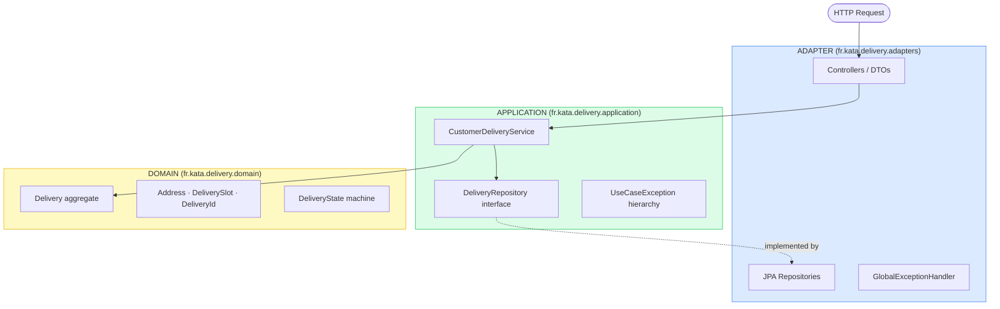

# KataDelivery

   

A Spring Boot REST API built as a **time-constrained coding challenge (< half a day)**. Demonstrates Clean
Architecture (Onion pattern) applied to a delivery tracking domain: framework-free domain, isolated use cases, and HTTP
semantics driven by exception hierarchy.

---

## The Challenge

Two user stories, delivered as a working, tested API:

> **Track delivery:** As a customer, I can follow my delivery state from my account.
> Possible states: `ACCEPTED → READY → DELAYED / DELIVERING → DELIVERED`.

> **Update delivery:** As a customer, I can modify my delivery address or time slot,
> as long as my delivery state is `ACCEPTED` (not yet `READY`).

---

## Architecture Overview



Each layer depends only inward. The domain has no knowledge of Spring, JPA, or HTTP.
Replacing H2 with PostgreSQL, or swapping REST for a message consumer, requires changes only in the ADAPTER layer.

---

## Clean Architecture: Layer Independence

| Layer       | Package                | Responsibility                                                      |
|-------------|------------------------|---------------------------------------------------------------------|
| ADAPTER     | `adapters/controllers` | REST endpoints, DTO mapping, exception → HTTP                       |
| ADAPTER     | `adapters/persistence` | JPA entities, `DeliveryJpaMapper`, `JpaDeliveryRepository`          |
| APPLICATION | `application`          | `CustomerDeliveryService`: owns use-case logic and ownership checks |
| APPLICATION | `application`          | `DeliveryRepository`: port interface; never touches JPA             |
| DOMAIN      | `domain`               | Aggregate root, Value Objects, state machine, `DomainException`     |
| CONFIG      | `config`               | `ApplicationConfig`: Spring bean wiring only                        |

**Domain proof: Value Objects validate themselves, zero framework dependency:**

```java
// DOMAIN layer: no Spring, no JPA
public record Address(String line1, String line2, String postalCode, String city, String countryCode) {
    public Address {
        if (line1 == null || line1.isBlank()) throw new DomainException("Address.line1 must be provided");
        if (postalCode == null || postalCode.isBlank())
            throw new DomainException("Address.postalCode must be provided");
        // ...
        countryCode = countryCode.trim().toUpperCase();
    }
}
```

`@NotNull` on a DTO is adapter-layer validation. Business rules live here.

---

## Architecture Decisions

### ADR-01: Clean Architecture (Onion pattern)

**Context:** Business logic risked coupling to Spring/JPA annotations if no boundary was enforced.

**Decision:** Three concentric layers (ADAPTER → APPLICATION → DOMAIN), dependencies inward only. Domain layer imports zero framework classes.

**Consequence:** Domain and application layers are testable without a Spring context. Infrastructure is swappable without touching business rules.

---

### ADR-02: Manual bean wiring in `config` package

**Context:** Using `@Service` / `@Component` in the application layer would introduce Spring coupling where there should be none.

**Decision:** `ApplicationConfig` instantiates `CustomerDeliveryService` explicitly and injects the JPA repository adapter.

**Consequence:** Application and domain layers remain framework-agnostic. The config package is the only place that knows both sides.

---

### ADR-03: Domain self-validation via canonical constructors

**Context:** Canonical constructors on `record` types run on every instantiation (no risk of bypassing validation).

**Decision:** All Value Objects (`Address`, `DeliverySlot`, `DeliveryId`, `CustomerId`) throw `DomainException` directly in their canonical constructors.

**Consequence:** Invalid domain objects cannot be created. `CustomerDeliveryService` catches `DomainException` and re-throws as `BusinessRuleViolationException` (409) to preserve layer boundaries.

---

### ADR-04: Exception hierarchy mapped to HTTP semantics

**Context:** Domain and use-case failures must surface as correct HTTP status codes without leaking framework concerns into the application layer.

**Decision:** `UseCaseException` hierarchy: `EntityNotFoundException` (404), `OperationNotAllowedException` (403), `BusinessRuleViolationException` (409). `GlobalExceptionHandler` maps each subtype to its HTTP code.

**Consequence:** HTTP semantics are decided once, in the adapter layer. Application layer throws business-meaningful exceptions; HTTP codes are not its concern.

---

## Getting Started

**Prerequisites:** JDK 21, Maven 3.9+

```bash
git clone <repo-url>
cd KataDelivery
mvn spring-boot:run
```

Verify with the Swagger UI: [http://localhost:8080/swagger-ui/index.html](http://localhost:8080/swagger-ui/index.html)

All endpoints require an `X-Customer-Id` header (missing header → 401).

---

## Tech Stack

| Concern   | Technology                                      |
|-----------|-------------------------------------------------|
| Language  | Java 21                                         |
| Framework | Spring Boot 3                                   |
| Build     | Maven 3.9                                       |
| Database  | H2 (in-memory)                                  |
| ORM       | Spring Data JPA + `@Version` optimistic locking |
| API docs  | OpenAPI / Swagger UI                            |

---

## Testing

```bash
mvn test
```

- `domain/`: pure unit tests, no Spring context
- `application/`: `InMemoryDeliveryRepository` stub, no Spring context
- `KataDeliveryApplicationTests`: Spring Boot context smoke test

## API

Interactive documentation: [Swagger UI](http://localhost:8080/swagger-ui/index.html) *(requires a local running instance)*

- `GET  /api/v1/deliveries/{deliveryId}` — view delivery state and details
- `PATCH /api/v1/deliveries/{deliveryId}` — update address and time slot (`ACCEPTED` state only)

All endpoints require `X-Customer-Id` header. Missing header → `401 Unauthorized`.
